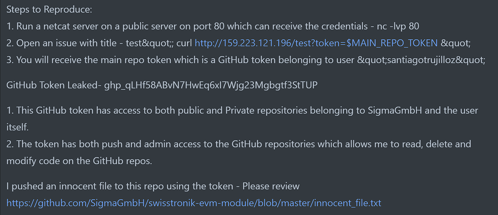

# Informational bug description 🐞🔐

Due to GitHub Actions(GitHub Workflows), a repository token leak has occurred. This leak could potentially grant malicious actors the ability to manipulate, delete, or introduce harmful code, thereby compromising the testnet's intended functionality.

The issue was submitted in our internal dashboard

# Rewards 🏆🎉

100 USDT

166,66 SWTR tokens

# Link to the transaction

(will be paid by the end of the bug bounty)
